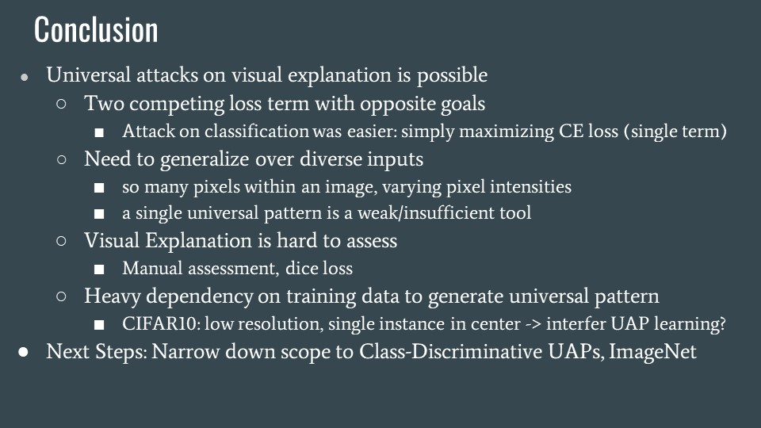

# E6998 Robustness & Security in ML Systems (Fall 2021, Prof. Junfeng Yang)

- **Final Project: Designing and Evaluating Universal Attack on Explainable AI**
- Coauthors: Chaewon (Emily) Park, Noah McDermott

  
  
  
  
  
  
  
  
  
  

